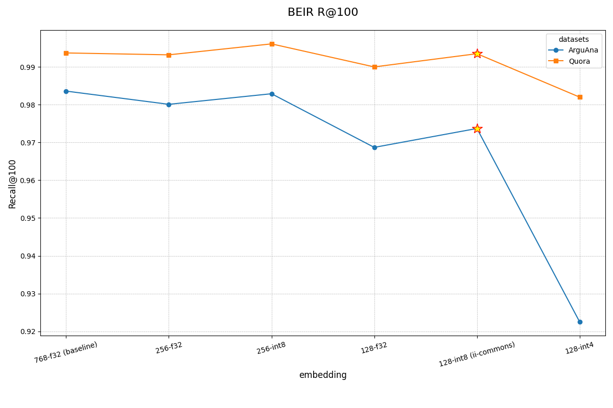

# Pre-computed Embedding Vector Datasets

We provide a series of pre-computed embedding vector datasets based on ArXiv paper data to help users quickly start and test the semantic search API. These datasets contain paper metadata, text from certain sections, and optimized embedding vectors. They can be downloaded and used directly, eliminating the need for time-consuming local embedding calculations.

## Dataset Contents

- **Data Source**: ArXiv academic paper repository.
- **Included Content**:
    - Complete paper metadata (title, authors, categories, etc.).
    - Full text content only for papers with Creative Commons (CC) or Public Domain licenses.
- **Content Focus**: To optimize performance in AI Agent search scenarios, we have specifically extracted and processed the three sections most suitable for retrieval: `abstract`, `introduction`, and `conclusion`.
- **Availability**:
    - We provide embeddings for the `abstract` of **all** papers.
    - We provide embeddings for the `introduction` and `conclusion` of **some** papers.

## Embedding Vector Processing

To achieve the best balance between storage cost, search performance, and retrieval accuracy, we processed the embedding vectors as follows:

1.  **Base Model**: Used the `Snowflake/snowflake-arctic-embed-m-v2.0` model to generate the original 768-dimensional vectors.
2.  **Dimensionality Reduction**: Reduced the 768-dimensional vectors to 128 dimensions.
3.  **Quantization**: Quantized the 128-dimensional floating-point vectors into `int8` format.

This process significantly reduces the dataset size and improves vector search speed while maintaining high retrieval accuracy in most scenarios.

## Performance and Accuracy

We have evaluated the accuracy loss during the dimensionality reduction and quantization process.

## How to Use

You can refer to the "Download Datasets" section in the root `README.md` file to download and use these datasets.

We offer multiple datasets corresponding to different content sections, for example:
- `arxiv_abstract_snowflake2_128_int8`: Contains embeddings for all paper abstracts.
- `arxiv_abstract_introduction_snowflake2_128_int8`: Contains embeddings for some paper introductions.

To use these datasets, configure the corresponding `repo_id` and `name` in your `api_server_config.yaml` file, and then run the `download_hf_duckdb.py` script.

